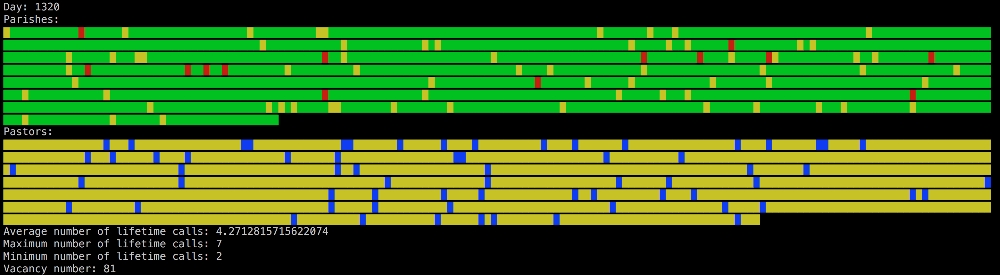

# WELS Pastoral Call Simulation

Simple simulation of WELS Pastoral Call Shortages

## How to install:

* Install rbenv
* Install Ruby 2.4.0 or jruby-9.1.7.0 (newer versions should work, adjust accordingly)
* Check out repository.
* Within repository, run `rbenv local 2.4.0` (adjust for jruby or other versions)
* Run `bundle install`.

## How to run:

```bash
bundle exec ruby simulate.rb
```

## Configuration

There are a configurable set of parameters at the top of `simulate.rb`. Customize to taste.

CALL_ACCEPTANCE_PROBABILITY = 0.2
DAYS_BETWEEN_CALLS_POST_ACCEPTANCE = MONTH*12*4 # 4 years
DAYS_BETWEEN_CALLS_POST_RETURN = MONTH*6 # Six months
CALL_DURATION = MONTH
CALL_DEVIATION = 14

NUMBER_OF_PARISHES = 1150
GAP_PERCENTAGE = 0.07

## (Possibly Invalid) Assumptions

One Pastor per Parish.

## Output Key

The output looks something like:



Parishes Key:
* Yellow: Open position, call extended
* Red: Open position, no eligable pastors
* Green: Serving Pastor

Pastors Key:
* Yellow: Unavailable for calls due to recency of previous call
* Green: Available for a call
* Blue: Holding a call to a new congregation
